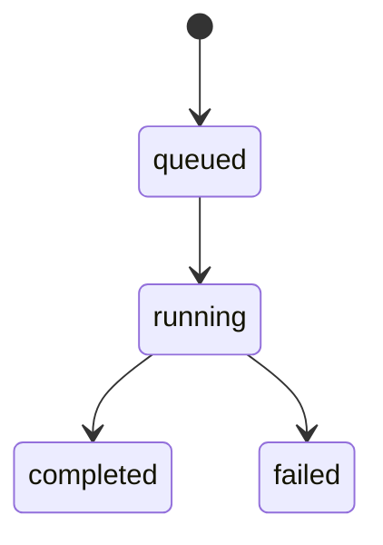

# Job Queue & Retry Logic — Cloud Backtesting

This document defines how backtest jobs are queued, processed, and retried in the cloud, with a focus on determinism, safety, and simplicity.

---

## 1. Goals

- Ensure every submitted job is processed exactly once (or clearly failed).
- Avoid duplicate executions and double results.
- Handle transient failures gracefully.
- Keep behavior deterministic and auditable.

---

## 2. Job Lifecycle

Jobs live in the `backtestJobs` collection and move through these states:

- `queued` → created by client
- `running` → picked up by worker
- `completed` → finished successfully
- `failed` → permanently failed

---

## 3. Single-Worker Assumption (v1)

To keep things simple and deterministic:

- Each job is processed by a **single worker instance**.
- We rely on Firestore trigger semantics + idempotent logic.
- No explicit distributed lock in v1.

If you later scale to very high volume, you can add a lock or lease mechanism.

---

## 4. Queue Model

### Enqueue

- Client creates `backtestJobs/{jobId}` with:
  - `status = "queued"`
  - `userId`
  - `configUsed`
  - `engineVersion`
  - `submittedAt`

### Dequeue (implicit)

- Firestore trigger `onCreate` on `backtestJobs/{jobId}`.
- Worker:
  - reads job
  - sets `status = "running"`
  - sets `startedAt`

---

## 5. Retry Philosophy

We distinguish between:

- **Transient errors** (network, data fetch, temporary infra)
- **Permanent errors** (invalid config, engine bug, corrupted data)

### v1 Policy (Simple & Safe)

- **No automatic retries** at the Firestore level.
- A job either:
  - completes successfully → `completed`
  - fails → `failed` with `errorMessage`

If you want retries, you **explicitly resubmit** from the client (or an admin tool) by creating a new job.

This avoids:

- double charges
- double results
- infinite retry loops
- hidden behavior

---

## 6. Optional: Retry Field (Future)

If you want to support controlled retries later, you can add:

- `retryCount: number`
- `maxRetries: number` (e.g., 3)

And a separate **admin-only** or **worker-only** mechanism to:

- set `status = "queued"` again
- increment `retryCount`

But in v1, we keep it out of the client path.

---

## 7. Idempotency Considerations

To avoid duplicate results:

- Worker checks if a result already exists for `jobId` before writing.
- If `backtestResults/{jobId}` exists:
  - log a warning
  - skip writing
  - still mark job as `completed` (or leave as is)

This protects against rare double-trigger scenarios.

---

## 8. Timeout Handling

If a job takes too long:

- Cloud Function / Cloud Run will eventually time out.
- Worker should:
  - rely on platform timeout
  - let the job remain `running` but effectively failed

Optional future enhancement:

- A scheduled cleanup job that:
  - finds `running` jobs older than N minutes
  - marks them as `failed` with `errorMessage = "timeout"`

---

## 9. Failure Semantics

On any unhandled exception:

- Worker sets:
  - `status = "failed"`
  - `errorMessage = <message>`
  - `completedAt = now()`
- No result document is written.

The client can:

- show failure state
- allow user to resubmit with a new job.

---

## 10. Summary

v1 Job Queue & Retry Design:

- **Simple queue:** `queued → running → completed/failed`
- **No automatic retries:** failures are explicit and visible
- **Idempotent writes:** avoid duplicate results
- **Deterministic behavior:** no hidden loops or background magic
- **Future-ready:** can add controlled retries and leases later

This keeps your cloud backtesting pipeline predictable, auditable, and aligned with your discipline-first philosophy.
